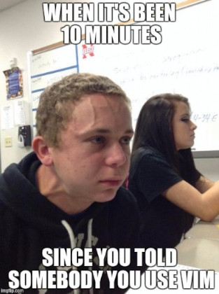

<!-- splash-page -->

# Vim As A Language

## A Demonstration Of Efficient Editing

---

## What We'll Cover

<!-- incremental-list -->

- What Vim Is
- Who Vim Is For
- Getting Started With Vim
- Practicing
- How Best To Learn
- Our codealong will be available later, so don't panic

---

## Getting The Most Out Of Today

<!-- incremental-list -->

- We'll be exposing you to Vim, but...
- ... don't expect to actually learn Vim today!
- Our codealong will be available later, so don't panic if you fall behind!

---

## What Is Vim?

It depends on who you ask! But some possible answers are:

- A terminal app for editing text files.
- A

---

## What's Special About Vim

_Nothing_. But Vim users eventually **all** become this guy:

<!-- .element: class="fragment" -->

So that's me now.<!-- .element: class="fragment" -->

Sorry.<!-- .element: class="fragment" -->

---
